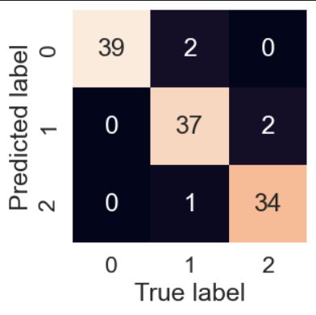

# Failure Mode Classification of Reinforced Concrete Columns using Machine Learning

## Overview

This project focuses on developing a machine learning model for the failure mode classification of Reinforced Concrete (R.C) columns. The primary goal is to predict the failure mode of R.C. columns based on relevant features. The implementation uses popular Python libraries such as NumPy, Pandas, Matplotlib, and Scikit-learn.

## Dependencies

- NumPy
- Pandas
- Matplotlib
- Scikit-learn

## Project Structure

- `data/`: Contains the dataset used for training and testing.
- `models/`: Stores the trained machine learning model.
- `notebooks/`: Jupyter notebooks used for data exploration, model development, and evaluation.

## Data

The dataset utilized for this project is provided in the `data/` directory. It includes features relevant to R.C. columns and corresponding labels indicating the failure mode.

## Model Development

### Addressing Imbalance

One of the challenges encountered during model development was dealing with imbalanced data, which led to overfitting. To mitigate this issue, Synthetic Minority Over-sampling Technique (SMOTE) was applied to oversample the minority class and balance the dataset.

## Usage

1. Clone the repository:

   ```bash
   git clone https://github.com/EugeneDenteh/Machine_Learning_model_for_the_failure_mode_classification_of_R.C_columns.git

Install dependencies:

bash
Copy code
pip install numpy pandas matplotlib scikit-learn
Run the notebook or script in the notebooks/ directory to train and evaluate the model.

Models
The trained machine learning model is stored in the models/ directory.

## Results

After extensive model development and fine-tuning, the following results were achieved:

- **F1 Score:** The model achieved an impressive F1 score of 97.38%, indicating a high level of precision and recall in classifying failure modes of Reinforced Concrete (R.C) columns.

- **Cross-Validation:** Cross-validation was employed to assess the model's performance across multiple subsets of the dataset. The consistent high F1 score across these folds validates the robustness of the model.

- **Confusion Matrix:** The confusion matrix was used to visualize the model's performance in detail. It provides insights into the true positives, true negatives, false positives, and false negatives, offering a comprehensive view of the classification results.
- 

These results showcase the effectiveness of the developed machine learning model in accurately classifying failure modes of R.C columns. Fine-tuning the model further contributed to its exceptional performance.


## Acknowledgments

I would like to express my gratitude to the following individuals and organizations for their support and contributions to this project:

- **Pacific Earthquake Engineering Research Center (PEER):** A special thanks to PEER for their valuable resources and insights that greatly contributed to the success of this project.

- **Ababio Godfred:** I extend my appreciation to Ababio Godfred, a supportive colleague who provided valuable assistance and guidance throughout the course of this project.

Your support has been instrumental, and I am truly thankful for your contributions.


Contact
For any inquiries or suggestions, feel free to contact Eugene Denteh at your edenteh5@gmail.com.


